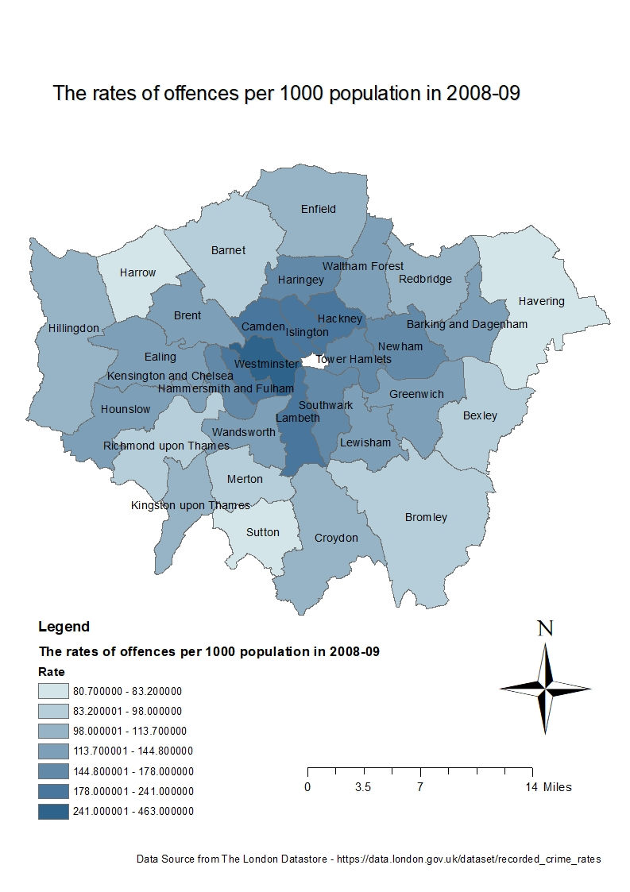

```{r}
library(tidyverse)
#wang the data in straight from the web using read_csv, skipping over the 'n/a' entries as you go...
crime_rates <- read_csv("~/Master SDSV/CASA0005/20%CW/industrial/crime rates sorted.csv")
# REMOVE SOME ROWS WITH MISSING VALUES
crime_rates<-crime_rates[complete.cases(crime_rates),]
# create a subset contain samples between 2008 and 2009
crime_rates_sorted<-subset(crime_rates,Year=="2008-09")


#Load Packages (ignore any error messages about being built under a #different R version):
library(maptools)
library(RColorBrewer)
library(classInt)
library(OpenStreetMap)
library(sp)
library(rgeos)
library(tmap)
library(tmaptools)
library(sf)
library(rgdal)
library(geojsonio)
library(shinyjs)
library(methods)

#read the shapefile into a simple features object
BoroughMapSF <- read_shape("N:\\Master SDSV\\CASA0005\\GIS\\wk3\\BoundaryData\\england_lad_2011.shp", as.sf = TRUE)

#check the class of BoroughMapSF
class(BoroughMapSF)

#join the data to the @data slot in the SP data frame
BoroughDataMap2 <- BoroughMapSF %>% left_join(crime_rates_sorted, by = c("label" = "Code"))#check it's joined.

BoroughDataMap2<-subset(BoroughDataMap2,Offences=="All recorded offences")
class(BoroughDataMap2)


tm_shape(BoroughDataMap2) +
  tm_polygons("Rate",
              style="jenks",
              palette="Reds",
              midpoint=NA,
              title="The rate of offences per 1000 population")+
  tm_compass(position = c("left", "bottom"),type = "arrow") + 
  tm_scale_bar(position = c("left", "bottom")) +
  tm_layout(title = "The rates of all offences per 1000 population in 2008/09", legend.position = c("right", "bottom"))

```

```{r}
 setwd("~/Master SDSV/CASA0005/20%CW/CW_20")
 
```
Part 1

Word count: 581 words

In this coursework, two maps are created separately using GUI-based GIS software and code-based software. Both maps illustrate how frequent the rates of all recorded offences are in 32 Boroughs in the year of 2008. The darker polygon the higher rate of all recorded offences in the corresponding area. 

##Benefits and drawbacks of GUI vs Command line generated maps:

GUI-based GIS software and code-based software are two useful application to make geospatial maps. ArcMap and R are taken in this coursework. 

Both software has similar functionalities. They have a environment called "geodatabase" and "project" which enable users to organise various kinds of works effectively and store all of file formats like shapefile and Comma-separated values you create and work for a particular task in the same working directory. In addition, the geospatial maps created using these two software include some basic features like scale bars, titles, legends, north arrows, etc.  

By comparison with ArcMap,  R is a code-based software. It is not easily accessible for the beginner, since it highly requires installation of specialised libraries and considerable familiarity with GIS concepts. Also, it is highly emphasis on a high level of proficiency in programming language. So ArcMap is more user-friendly to allow people who is not familiar with programming. It allows users to interact with the system through graphical icons and visual indicators.  

In addition, ArcMap uses layers as a mechanism for displaying geospatial datasets. In ArcMap, each layer references a piece of dataset, specifies how to use symbols and text labels to describe the data set, and does not affect other layers during processing. 

On the other hand, R is an open source software which is freely enabled to use for everyone. It is available for Linux, Mac and Windows users. On the contrary ArcMap needs users to pay for using, and is only available for Windows users. Also, it takes up more storage space than R does. 

Furthermore, the simplest map in R does not require data files as some packages have included outlines of continents, countries and states.  And also, R allows to produce reproducible works. As a result of code-based pattern, the codes can be a template under similar works. Users only need to copy and edit codes for plotting new similar maps.

##The data sources used in their generation:

Two datasets are focused in this coursework. One is the most recent boundaries for the 32 London boroughs in shapefile format, which is downloaded from the Edina Census Geography website. The other is related to crime and safety community in England and Wales, downloaded from the London Datastore. The data was created by MPs and  Home office. The dataset contains numbers of recorded offences, and rates of offences per thousand population from 1999 to 2017 in England and Wales but excluding the city of London. This coursework will consider the sub-group of the rates of all recorded offences are in 32 Boroughs in the year of 2008. 


##A review of the workflows used to generate both maps:

For the ArcMap, the workflow is, to clean up the data using Excel then attach the cleaned-up data into the ArcMap. ArcMap cannot clean up data, but R have tools to easily clean up data. R is far ahead of ArcMap in this respect. When plotting, add the layers into the map, a collection of offence records mentioned above. For the R, we will make use of a function qtm() from tmap package which enable users to make maps very easily.

